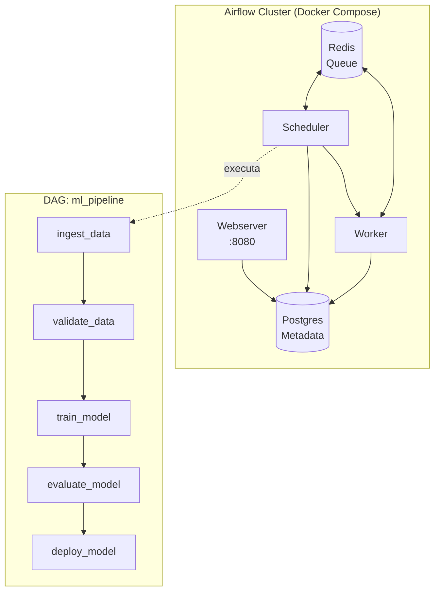
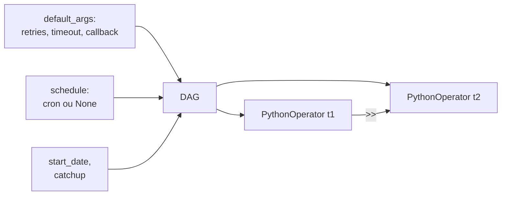

# 🏗️ Arquitetura — Aula 05: Orquestração com Airflow

A **Aula 05** transforma o pipeline da Aula 01 em uma **DAG do Airflow**, com retry, alertas, schedule e monitoramento centralizado.

---

## 🎯 Visão Geral



---

## 📁 Estrutura de Diretórios

```
fiap-ml-aula05/
├── .gitignore
├── README.md
├── requirements.txt
├── docker-compose.yaml         # Airflow oficial
├── .env                        # AIRFLOW_UID (gerado por host)
├── docs/
│   ├── ARCHITECTURE.md
│   ├── CHEATSHEET.md
│   ├── HANDS-ON-05-01.md       # Setup
│   ├── HANDS-ON-05-02.md       # Pipeline ML
│   └── HANDS-ON-05-03.md       # Boas práticas
├── dags/
│   ├── hello_world_dag.py
│   ├── ml_pipeline_dag.py
│   └── ml_pipeline/
│       └── tasks/
│           └── ml_tasks.py
├── logs/                       # Logs do Airflow (gitignored)
├── plugins/
└── config/
```

---

## 🔄 Anatomia de uma DAG



| Componente | Função |
|------------|--------|
| `DAG` | Container do pipeline |
| `default_args` | Política para todas tasks (retry, alert) |
| `schedule` | Quando rodar (cron, intervalo, None) |
| `start_date` | A partir de quando |
| `catchup` | Se roda execuções passadas |
| `PythonOperator` | Executa função Python |
| `>>` | Define dependência |
| `xcom_pull/push` | Compartilha dados pequenos entre tasks |

---

## 🧱 Decisões de Design

### 1. Docker Compose oficial
Usar o `docker-compose.yaml` do Airflow Apache. Em produção real: K8s + Helm chart.

### 2. PythonOperator (não BashOperator)
Mantém código Python testável e modular. Bash seria opaco para CI/CD.

### 3. XCom para metadados, não para dados
Passar **caminho** de arquivo, **ID** ou **métrica**. Nunca DataFrames.

### 4. Tasks idempotentes
`mkdir -p`, `INSERT ... ON CONFLICT`, sempre sobrescrever em vez de acumular.

### 5. Lógica em módulo, DAG só orquestra
`ml_tasks.py` tem funções puras; `ml_pipeline_dag.py` só amarra com `>>`.

### 6. `catchup=False` por default
Evita explosão de execuções históricas quando ativa DAG.

---

## 🆚 Analogia com Jenkins/GitHub Actions

| Airflow | Jenkins | GitHub Actions |
|---------|---------|----------------|
| DAG | Pipeline | Workflow |
| Task | Stage | Job |
| Operator | Step | Action |
| Scheduler | Master | GitHub runner |
| Worker | Agent | Runner |
| XCom | Env vars / artifacts | `outputs` |
| UI :8080 | UI :8080 | Aba Actions |

> 💡 Você JÁ sabe orquestrar (Jenkins, GitHub Actions). Airflow é a **mesma família** — diferença é vocabulário.

---

## 🚀 Próximo Passo

Aulas 06 (Qualidade) e 07 (Re-treino) vão **estender** essa DAG, adicionando tasks de validação com Great Expectations e re-treino automático baseado em drift.
